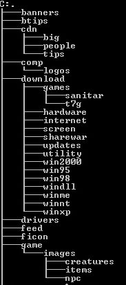

## Język skryptowy
Python - [dokumentacja](https://docs.python.org/3/tutorial/index.html)

## Zadania
1. ***(1ptk)*** Napisz skrypt przyjmujący rozszerzenie pliku oraz ścieżkę, który wylistuje wszystkie pliki o podanym rozszerzeniu w podanym w katalogu.
2. ***(2ptk)*** Napisz skrypt, który wylistuje rekursywnie strukturę plików i katalogów dbając o odpowiednie wcięcia. Przykład:
   
   

3. ***(1ptk)*** Napisz skrypt, który przyjmie listę (może być jako osobne parametry) liczb, a w wyniku zwróci listę posortowaną rosnąco.
4. ***(4ptk)*** Napisz prosty program pozwalający użytkownikowi zagrać z komputerem w papier kamień nożyce. Na początku użytkownik powinien mieć możliwość zdefiniowania liczby rund w rozgrywce. W każdej rundzie program powinien pozwolić użytkownikowi na wprowadzenie wyboru (papier, kamień, nożyce) oraz w losowy sposób powinien dobierać wybór komputera. Liczba zwycięstw przeciwników powinna być zliczana i po określonej liczbie rund program powinien wyłonić zwycięzcę pokazując sumę zwycięstw, porażek i remisów dla.

Rozwiązania umieść w folderze `Solutions` i opublikuj w formie ***Pull Request*** do tego repozytorium do gałęzi odpowiadającej Twojemu numerowi identyfikacyjnemu.