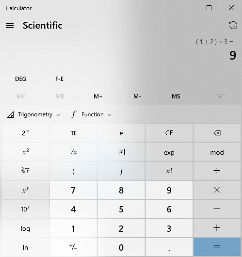

## Język skryptowy
Python - [dokumentacja](https://docs.python.org/3/tutorial/index.html)
Alternatywnie JavaScript/TypeScript dla zaawansowanych - [TypeScript](https://www.typescriptlang.org) + [React](https://reactjs.org) lub [Angular](https://angular.io) lub [Vue](https://vuejs.org)

## Zadanie
Napisz program posiadający interfejs okienkowy, który pozwoli użytkownikowi na wprowadzenie równiania i jego obliczenie.

Wymagania:
1. ***(2 ptk.)*** Program musi pytać użytkowania o zdefiniowanie równania w formie jednego ciągu znaków:

   `1 + 2 * 3`

   Dla którego następni obliczy wynik

   `1 + 2 * 3 = 7`

   

3. ***(1 ptk.)*** Program wspiera liczby rzeczywiste (obsługuje operacje zmiennoprzecinkowe).

4. ***(2 ptk.)*** Poszczególne podwyrażenia równania powinny być przechowywane w słowniku/drzewie i istnieje możliwość jego wizualizacji w formie graficznej
   
   

5. ***(1 ptk.)*** Program wspiera podstawowe operacje arytmetyczne (uwzględniając pierwszeństwo operacji): 
   - `+` ➡ dodawanie
   - `-` ➡ odejmowanie
   - `*` ➡ mnożenie
   - `/` ➡ dzielenie
   - `()` ➡ operacje w nawiasach
6. ***(sum. 4 ptk.)*** Program wspiera złożone operacje arytmetyczne:
   - ***(0.5 ptk.)*** `x^y` ➡ potęgowanie
   - ***(0.5 ptk.)*** `x!` ➡ silnia
   - ***(0.5 ptk.)*** `sqrt(x)` ➡ pierwiastkek kwadratowy
   - ***(0.5 ptk.)*** `|x|` ➡ wartość absolutna
   - ***(0.5 ptk.)*** `mod(x)` ➡ modulo
   - ***(0.5 ptk.)*** `1/x` ➡ odwrotność
   - ***(1 ptk.)*** `log(x)` ➡ logarytm o podstawie 10 z `x`

## Publikowanie rozwiązań
Rozwiązania umieść w folderze `Lab 5/Solutions` i opublikuj w formie ***Pull Request*** do tego repozytorium do gałęzi odpowiadającej Twojemu numerowi identyfikacyjnemu.