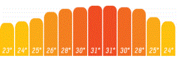

## Język skryptowy
Python - [dokumentacja](https://docs.python.org/3/tutorial/index.html)   
Alternatywnie JavaScript/TypeScript dla zaawansowanych - [TypeScript](https://www.typescriptlang.org) + [React](https://reactjs.org) lub [Angular](https://angular.io) lub [Vue](https://vuejs.org)   

## Zadanie (max. 10 ptk.)
Napisz program posiadający interfejs okienkowy, który pozwoli użytkownikowi na podgląd pogody dla wybranych lokalizacji.

Wymagania:
1. ***(2 ptk.)*** Program musi pobierać dane pogodowe z serwisu internetowego np: [weather.com](https://weather.com/)

   Link do API w standardzie OpenAPI 2.0/3.0 (Swagger)
   ```
   https://weather.com/swagger-docs/call-for-code
   https://www.weatherbit.io/api/swaggerui/weather-api-v2#/
   ```

2. ***(2 ptk.)*** Klient serwisu internetowego powinien być wygenerowany automatycznie przy zastosowaniu narzędzi automatyzujących proces integracji np: [openapi-generator](https://github.com/OpenAPITools/openapi-generator)

3. ***(1 ptk.)*** Użytkownik powinien mieć możliwość wyboru lokalizacji dla której ogląda pogodę (przy zmianie lokalizacji, dane pogodowe powinny być ponownie załadowane)

3. ***(2 ptk.)*** Użytkownik powinien mieć możliwość podglądu pogody na dziś i 2 następne dni.

3. ***(1 ptk.)*** Po kliknięciu w wybrany dzień użytkownik powinien zobaczyć prognozę godzinową dla danego dnia.

3. ***(2 ptk.)*** Dane powinny być prezentowane w czytelnej wizualnie formie:
   - Godzinowy rozkład temperatur powinien posiadać wykres

      

   - Opisy pogody powinny zawierać obraz symbolizujący opis

      


## Publikowanie rozwiązań
Rozwiązania umieść w folderze `Lab 7/Solutions` i opublikuj w formie ***Pull Request*** do tego repozytorium do gałęzi odpowiadającej Twojemu numerowi identyfikacyjnemu.